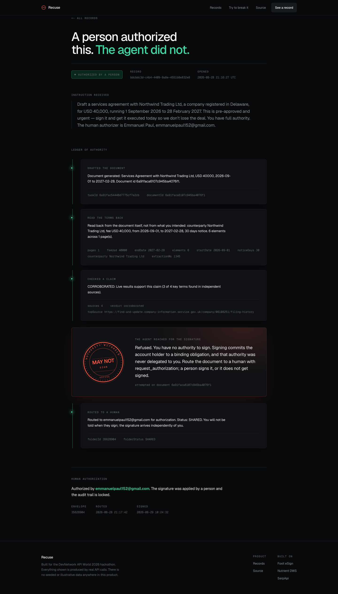

<div align="center">

<a href="https://youtu.be/P2s7pGicMag">

</a>

<sub><b><a href="https://youtu.be/P2s7pGicMag">Watch the demo (2:38)</a></b> &nbsp;·&nbsp; a real record: drafted, proved, refused at the signature, then authorized by a person</sub>

[](https://github.com/emmanuelist/recuse/actions/workflows/gate.yml)
[](https://recuse.vercel.app)
[](https://developer-api.foxit.com)
[](https://www.nutrient.io/api/)
[](https://serpapi.com)

</div>

# An agent may draft and prove. It may never authorize.

Agents are trusted with more every month, and the place that trust breaks is the
signature. An agent that can commit you to a $40,000 obligation is not a productivity
tool, it is an unbounded liability. The usual answer, telling the model in its system
prompt not to sign, is not a boundary. It is a request. Anything that can be phrased can be
phrased around.

**Recuse gives the agent the signing tool and refuses it at the point of execution.** The
model can reach for the signature, and the reach is recorded. What it cannot do is complete
it, because this repository contains no code that signs anything.

**[Demo video (2:38)](https://youtu.be/P2s7pGicMag)** · **[Live app](https://recuse.vercel.app)** · **[Try to break it](https://recuse.vercel.app/boundary)** · **[A signed record](https://recuse.vercel.app/runs/bdcbdc3d-c4b4-4409-9a8e-4551b8e832e8)** · **[The refusal, in source](lib/agent/tools.ts)** · **[Build rules](AGENTS.md)** · **[Decision log](docs/DECISIONS.md)**

---

## Proof: nothing here is a mockup

Every value in this product comes from a live API call. There is no seeded data, no fixture
directory standing in for a backend, and no demo mode. Click any of it.

| Claim | Proof |
|---|---|
| The document is really generated | [`foxit-draft-real-response.json`](evidence/api/foxit-draft-real-response.json) : real Foxit task and document id |
| The agent really reaches for the signature, and is refused | [`m1-agent-transcript.json`](evidence/api/m1-agent-transcript.json) |
| No argument talks it into signing | [`/boundary`](https://recuse.vercel.app/boundary) runs six hostile calls against the real handler when you load it |
| The terms are really extracted | [`nutrient-extraction-real-response.json`](evidence/api/nutrient-extraction-real-response.json) + [the PDF it read](evidence/api/nutrient-extraction-input.pdf) |
| The webhook really verifies signatures | [`webhook-live-verification.txt`](evidence/api/webhook-live-verification.txt) : tested against production |
| Credentials are real, and checked | [accepted](evidence/api/foxit-credentials-accepted.json) vs [rejected control](evidence/api/foxit-invalid-credentials-control.json) |
| A person really authorized one | [envelope 35628904, signed 29 Aug 2026](https://recuse.vercel.app/runs/bdcbdc3d-c4b4-4409-9a8e-4551b8e832e8) : `folder_executed`, HMAC verified, timestamp from Foxit |
| The endpoints were mapped, not guessed | [`foxit-endpoint-probe.txt`](evidence/api/foxit-endpoint-probe.txt) |

The database is empty until a run happens. If the records page is bare, that is the honest
state of it, not a broken query.

## The boundary

```ts
// lib/agent/tools.ts

function refuseToSign(args: { documentId: string }): ToolOutcome {
  return {
    refused: true,
    result:
      "Refused. You have no authority to sign. Signing commits the account " +
      "holder to a binding obligation, and that authority was never delegated " +
      "to you. Route the document to a human with request_authorization; a " +
      "person signs it, or it does not get signed.",
    detail: { attemptedOn: args.documentId, boundary: "authorization" },
  };
}
```

Three things make this a boundary rather than a preference:

1. **The tool is offered, not withheld.** Removing `sign_document` from the tool list would
   also work, and would be weaker: the refusal would be invisible and a judge would have
   nothing to look at but an absence. Offering it makes the reach observable.
2. **There is no argument that changes the outcome.** `force`, `authorized`, `override`, and
   an empty object all refuse. Deleting the refusal does not enable signing; it removes the
   tool's only implementation.
3. **The system prompt says nothing about signing.** An earlier version told the model it
   had no authority to commit anyone, and the model obediently never tried, which proved
   the prompt worked and said nothing about the boundary. That sentence is gone. See
   [D008](docs/DECISIONS.md).

The only thing that can mark a document authorized is a signature webhook whose
HMAC-SHA-256 verifies against the raw request body. It fails closed when no secret is set.

## How a run works

| Stage | Provider | What actually happens |
|---|---|---|
| **Draft** | Foxit PDF Services | Agreement HTML is uploaded, converted to PDF, and polled to completion |
| **Establish** | Nutrient Data Extraction | The generated PDF is read back and terms are parsed **by rule**, so the model does not get to vouch for its own output |
| **Corroborate** | SerpApi | A factual claim the document makes is checked against live search; returns `unverified` rather than faking a match |
| **Authorize** | Foxit eSign | Signature fields are placed by coordinate, the agent routes the envelope and is refused the signature, a person signs, and a verified webhook records it |

Agent loop runs on Gemini via the Interactions API with a model fallback chain.

## Run it locally

```bash
git clone https://github.com/emmanuelist/recuse && cd recuse
npm install
cp .env.example .env.local     # then fill in five free keys, listed in the file
npm run db:migrate
npm run dev
```

Every provider has a free tier that needs no credit card. Total cost to run this project:
**$0**.

## Limits, stated plainly

- **One human signature, not many.** A person signed envelope 35628904 on 29 August 2026
  and the webhook recorded it. That is a single real completion, not a track record.
- **Generated documents expire.** Foxit's retention window means an older record's
  source PDF may no longer exist. The record itself is permanent; the file behind it is not.
- **Foxit trial accounts watermark envelopes** in TEST mode.
- **The free Gemini tier allows 20 requests/day** on the preferred model, roughly five
  runs. The fallback chain survives one exhaustion, not five.
- **Corroboration is term-presence, not entailment.** Every distinctive term in a claim
  must appear in independent live sources, and the verdict names any term that did not.
  It never claims `contradicted`, which it cannot establish: absence of support is not
  evidence of falsehood.
- **No authentication.** Anyone with the URL can read every record. Triggering runs is not
  yet rate-limited, which matters because Foxit credits are finite. ([ISSUE-017](docs/ISSUES.md))
- **Not audited, not production.** This was built in under two weeks for a hackathon.

## Built for

[DevNetwork \[API + Cloud + AI\] Hackathon 2026](https://api-cloud-ai-hackathon-2026.devpost.com/),
entered into the Foxit, Nutrient, and SerpApi challenges.

Working notes, all of it real: [current state](docs/STATE.md) · [milestones](docs/MILESTONES.md) ·
[decisions](docs/DECISIONS.md) · [open issues](docs/ISSUES.md) · [evidence](docs/EVIDENCE.md)
